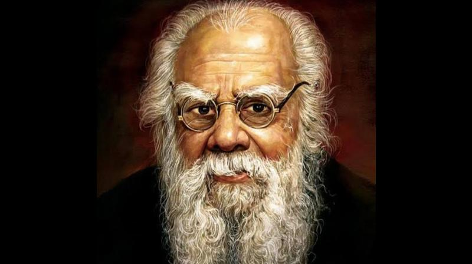
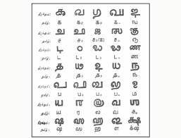
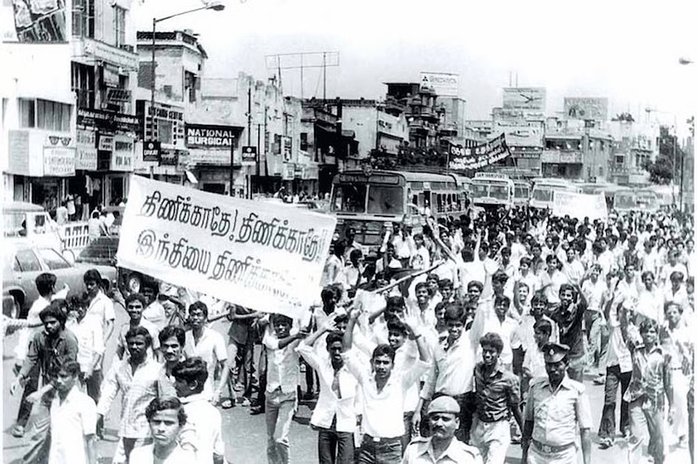
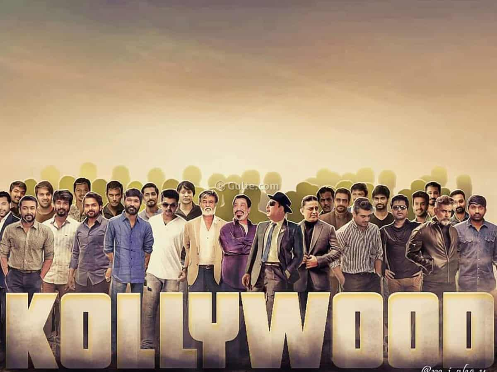
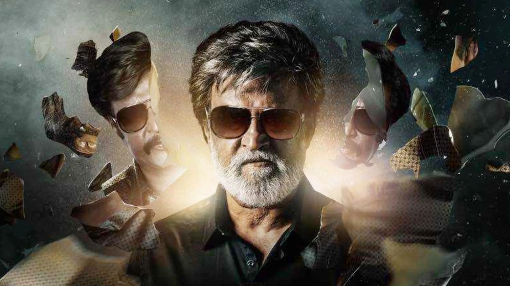
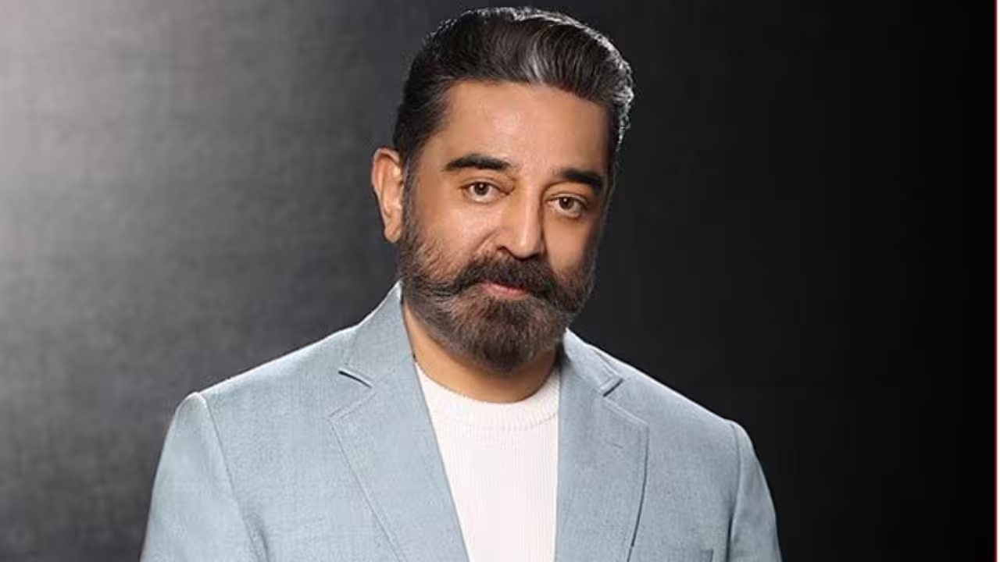
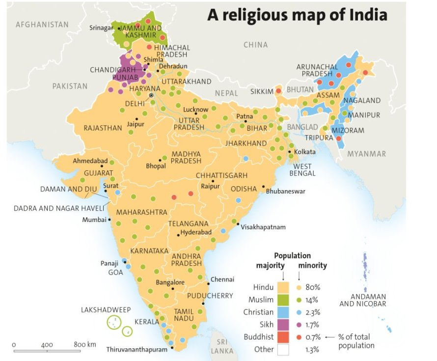
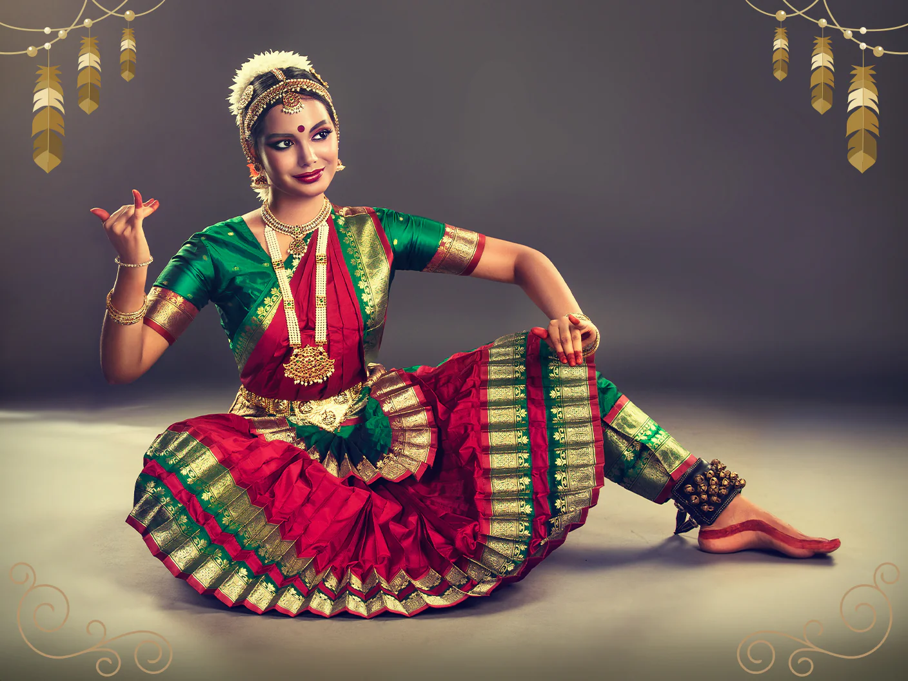

# Unveiling Tamil Nadu: History, Culture, and Contemporary Insights

Tamil Nadu, a state rich in ancient heritage and vibrant traditions, has long been a cradle of cultural and political evolution in India. Drawing from a insightful discussion between historian Keerthi History (Keerthika Govindhasamy) and podcaster Ranveer Allahbadia on *The Ranveer Show* (Episode 307, released in 2023), this write-up explores the untold facets of Tamil Nadu's history, societal dynamics, and modern influences. Enhanced with historical context and cultural nuances, it highlights how Tamil identity intertwines with politics, cinema, and everyday life, while addressing perceptions of division and unity within India.

## Historical Foundations: From Ancient Empires to Independence Struggles

Tamil Nadu's history is often overshadowed in national narratives, yet it boasts a legacy of powerful empires and revolutionary fervor. The discussion emphasizes the disappointment with how Indian history is taught, focusing on a narrow, North-centric view that neglects Southern contributions. For instance, ancient Tamil kingdoms like the Cholas, Pandyas, and Pallavas were maritime powers that influenced Southeast Asia, yet school curricula rarely delve into these achievements.

The Tamil perspective on Indian independence reveals a complex narrative. While the region celebrated figures like Mahatma Gandhi, local revolutionaries such as Vattakudi Irular and poet Subramania Bharati played pivotal roles in anti-colonial resistance. Early rebellions, including the Poligar Wars (1799–1801) led by figures like Veerapandiya Kattabomman and the Marudu brothers, predated the 1857 Revolt and challenged British dominance. Post-independence, some Tamil political parties, influenced by Dravidian ideologies, briefly advocated for a separate nation in the 1960s, but this was abandoned due to anti-secession laws. These movements underscored a desire for regional autonomy amid fears of cultural erasure.

Central to this is the Dravidian Movement, which emerged in the early 20th century as a response to caste hierarchies and Brahmin dominance in Madras Presidency. Founded with the Justice Party in 1916 by leaders like C. Natesa Mudaliar and P. Theagaraya Chetty, it evolved into a broader socio-political ideology promoting rationalism, anti-caste reforms, and Dravidian identity encompassing South Indian states (Tamil Nadu, Kerala, Karnataka, Andhra Pradesh, and Telangana). The movement birthed parties like the DMK and AIADMK, shaping Tamil politics through self-respect and social justice. Initially separatist (demanding Dravida Nadu), it shifted to federalism after independence, but its legacy persists in resisting perceived Northern impositions.

## Cultural Identity: Language, Pride, and Resistance

Tamilians exhibit a deep emotional attachment to their language and heritage, often described as "breathing Tamil." This pride stems from a unique script, ancient literature like the Sangam poems, and symbols such as distinct numerals. However, there's concern over erosion in modern times due to globalization and migration.

 The resistance to Hindi imposition is a hallmark of this identity. Rooted in the 1930s under C. Rajagopalachari's mandatory Hindi policy in schools, it escalated into the Anti-Hindi Agitations of the 1960s, involving protests, self-immolations, and over 70 deaths. These movements toppled Congress rule in 1967 and ensured English's co-official status, viewing Hindi as a threat to Tamil's classical status.

 Today, while organic Hindi adoption isn't opposed, forced imposition sparks memes and political backlash rather than mass protests.

Hindu pride in Tamil Nadu is nuanced, often suppressed by atheist-leaning education systems and political narratives labeling it as extremism. The discussion touches on perceptions of spiritual figures like Sadhguru, where media often spreads misinformation (e.g., about the Isha Foundation's environmental impact), but personal experiences reveal transformative teachings and ethical practices. This reflects broader tensions between Dravidian rationalism and Hindu revivalism.

## Education, Politics, and Generational Shifts

Education in Tamil Nadu is highly valued, with a focus on job-oriented learning over entrepreneurship. Post-1950s reforms under K. Kamaraj boosted literacy from 7% to 37% in a decade, emphasizing rural access. Villages show remarkable political awareness, with residents avidly following "political dramas" via media. Politics remains engaging, tied to cinema and local issues.

Gen Z in Tamil Nadu blends tradition with modernity: high IQ/EQ, emotionally sensitive, but grappling with mental health from social media. Parental control is strict, prioritizing discipline and ethics. Business outlooks undervalue entrepreneurship, favoring white-collar stability and humility, though family businesses persist without the North's celebratory flair.

## Cinema: Stardom, Politics, and Cultural Mirror

Tamil cinema, or Kollywood, is a powerhouse of superstardom and political influence. Icons like Rajinikanth and Kamal Haasan dominate, with Rajinikanth's mass appeal stemming from relatable personas and blockbuster versatility, while Haasan's artistry shines in diverse roles like writing and directing. Their recent reunion in films like *KHxRK* (2026) highlights enduring legacies, having co-starred in classics from the 1970s-80s.

The cinema-politics nexus is unique to Tamil Nadu. Dravidian leaders like C.N. Annadurai and M. Karunanidhi used films for propaganda, embedding social justice themes. Stars like M.G. Ramachandran (MGR) transitioned to chief ministership via AIADMK, leveraging screen images of the oppressed's savior. Politicians often control releases, creating a cycle where actors enter politics (e.g., J. Jayalalithaa, Vijay). This interplay continues, though less dominantly, with films like *Jana Nayagan* sparking controversies.

 

| Aspect | Rajinikanth | Kamal Haasan |
|--------|-------------|--------------|
| Stardom Style | Mass appeal, swagger, audience connection | Versatile acting, experimentation, intellectual depth |
| Political Ties | Fan base influences elections; brief party launch | Active in politics via Makkal Needhi Maiam party |
| Blockbusters | Films like *Jailer* (2023) | Epics like *Thug Life* (2025) |

## Social Dynamics: Romance, Gender, and Regional Comparisons

Dating in Tamil Nadu is orthodox, geared toward marriage rather than casual flings. Public displays are rare, and apps like Tinder are stigmatized, especially in villages. Tamil girls are often open to North Indian partners for their expressive romance, while Tamil boys admire Malayali girls. However, shyness prevails—Tamil men express love through actions, not words, contrasting with vocal North Indian styles. Emotional unavailability among men is attributed to cultural conditioning, though women hold household decision-making power.

Differences between Tamil girls and boys highlight subtle gender roles: girls face stricter curfews, but both value ethics. Among South Indian states, Tamil Nadu emphasizes pride and intellect; Kerala is relaxed; Andhra/Telangana focus on food and family. Safety for women is higher in the South, with less overt sexism.

North-South cultural divides are stark: North India features inflectional languages (e.g., Hindi), wheat-based diets, and syncretic traditions from invasions; South India has agglutinative languages (e.g., Tamil), rice staples, and preserved ancient customs. North is often seen as brash and showy, South as polite and humble. Yet, both share democratic values, with overlaps in festivals and family centrality.

| Dimension | North India | South India |
|-----------|-------------|-------------|
| Language | Hindi/related, shared scripts | Dravidian languages, unique scripts |
| Cuisine | Wheat, spicy curries | Rice, coconut-based, milder spices |
| Social Norms | More extroverted, flexing culture | Reserved, emphasis on humility |
| Arts | Kathak dance, Bollywood influence | Bharatanatyam, Karnatak music, Kollywood |

## Conclusion: A Tapestry of Unity and Diversity

Tamil Nadu embodies India's pluralistic essence, where ancient pride meets modern challenges. From Dravidian resistance to cinematic political legacies, the state challenges monolithic narratives of Indian history. As Keerthi and Ranveer's conversation reveals, fostering understanding across North-South divides—through education, media, and dialogue—can bridge perceived gaps, celebrating shared heritage while honoring regional uniqueness. This cultural mosaic not only enriches India but also inspires global appreciation for its depth.