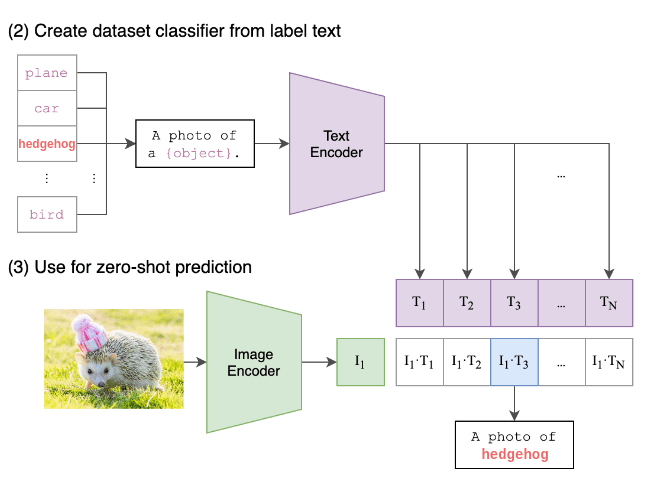

### 1. Core Architecture

**CLIP (Contrastive Language-Image Pretraining, OpenAI 2021)**  
Two independent encoders:
- Image encoder (ViT or ResNet)
- Text encoder (Transformer)  
They project into a shared embedding space and are trained to align matching pairs. No interaction beyond a final dot-product similarity. Purely **discriminative**  no predictor or query mechanism.

**VL-JEPA (Vision-Language JEPA, Meta FAIR 2025)**  
Asymmetric predictive architecture:
- **X-Encoder**: Frozen V-JEPA 2 ViT-L (video-native, spatio-temporal)
- **Y-Encoder**: Target text -> semantic embedding S_Y
- **Predictor** (8 Llama-3.2-1B layers): Takes vision + optional text query and **predicts** the target embedding Ŝ_Y in one forward pass
- Lightweight Y-Decoder (only at inference when needed)

VL-JEPA is **predictive** (JEPA-style), while CLIP is **contrastive alignment only**.

### 2. Training Objective

**CLIP**: Symmetric contrastive loss (InfoNCE variant).  
Maximizes cosine similarity of matched ../../Images/JEPA/image-text pairs and minimizes it for negatives in a batch. Learns alignment, not prediction.

**VL-JEPA**: Bi-directional InfoNCE in latent space + prediction loss.  
The Predictor learns to **forecast** the semantic embedding of the target text from vision (and optional query). It abstracts away wording variations  multiple captions for the same scene collapse together.

Result: VL-JEPA focuses on **meaning**, CLIP on **surface matching**.

### 3. Capabilities & Supported Tasks

**CLIP**:
- Zero-shot image classification (text as classifier)
- Image-text retrieval
- Limited to still images (video only via frame sampling)
- No generation, no VQA, no reasoning with queries

**VL-JEPA**:
- Native video understanding (8–32 frames)
- Zero-shot/open-vocab classification
- Text-to-video retrieval
- Discriminative VQA
- Selective captioning/generation
- One unified model  no architecture changes needed for any task

VL-JEPA adds **reasoning** (via query-conditioned prediction) and generation that CLIP completely lacks.

### 4. Performance (Zero-Shot Video Benchmarks)

From the official VL-JEPA paper (arXiv:2512.10942, Table 1  8 video classification + 8 retrieval datasets):

**Average Video Classification (Top-1 Accuracy)**:
- CLIP ViT-L/32: 28.3%
- CLIP ViT-L/14: 29.7%
- SigLIP2: 34.0%
- Perception Encoder (best baseline): 34.5%
- **VL-JEPA BASE**: **40.4%**
- **VL-JEPA SFT**: **52.3%**

**Average Text-to-Video Retrieval (Recall@1)**:
- CLIP: 27.6%–47.2%
- SigLIP2: 50.9%
- Perception Encoder: 58.7%
- **VL-JEPA BASE**: **83.1%**
- **VL-JEPA SFT**: **89.3%**

VL-JEPA BASE already beats every CLIP/SigLIP variant by a large margin on video tasks  despite using a smaller vision backbone and less data in some comparisons. After SFT, it approaches specialist models while remaining a single unified system.

### 5. Efficiency & Inference

**CLIP**: Extremely fast for retrieval/classification (just two encoders + dot product). But no video streaming support and no generation.

**VL-JEPA**:
- 1.6B total parameters (50% fewer trainable than comparable VLMs)
- Non-autoregressive embedding prediction (one pass)
- **Selective decoding**: ~2.85× fewer text generation steps (only decode when meaning changes  ideal for live video)
- Much better for real-time streaming, robotics, or long videos

CLIP is simpler and cheaper for static image tasks; VL-JEPA wins dramatically for anything dynamic or multi-task.

### 6. Strengths & When to Use Each

**Use CLIP when**:
- You need battle-tested, open-source zero-shot image classification/retrieval
- Simple embedding-based pipelines (hundreds of open implementations)
- Static images only

**Use VL-JEPA when**:
- Video understanding or streaming is required
- You want one model for classification + retrieval + VQA + captioning
- Efficiency and real-time performance matter
- Robustness to phrasing variations is important

### 7. Limitations

**CLIP**:
- Outdated for video
- Cannot answer questions or generate descriptions
- Performance plateaus on complex reasoning

**VL-JEPA** (as of March 2026):
- No official weights/code released yet (community ports exist but unofficial)
- Generation quality tied to lightweight decoder (less fluent than full autoregressive VLMs for long creative text)
- Strongest on video; slightly weaker on pure appearance-only image tasks compared to image-heavy models

### Bottom Line

CLIP revolutionized zero-shot vision-language with simple contrastive alignment.  
**VL-JEPA is the next evolution**: it replaces alignment with **prediction in semantic space**, adding video nativity, reasoning, generation, and massive efficiency gains.

On video benchmarks, VL-JEPA isn’t just better  it’s in a different league, achieving state-of-the-art with fewer parameters and far more capabilities. This is exactly the shift Yann LeCun has advocated for years: move from “predicting tokens” to “predicting meaning.”

> If your use case is static images and retrieval -> CLIP is still excellent and ready today.  
> If you need video, multi-task, or real-time -> VL-JEPA represents the future.