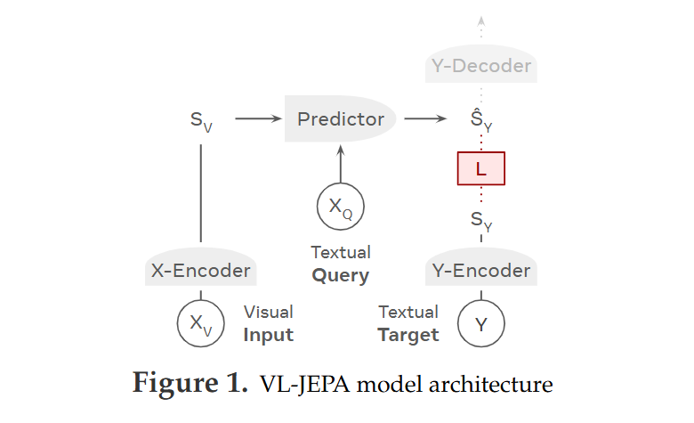

# VL-JEPA Predictor Mechanism: The Core "Brain" Explained

The **Predictor** is the single most important trainable component in VL-JEPA (arXiv:2512.10942). It is what makes the model **predictive** instead of generative. While traditional VLMs generate tokens autoregressively, the VL-JEPA Predictor does **one single forward pass** to predict an abstract semantic embedding of the target text  exactly as Yann LeCun’s JEPA philosophy intends: “predict meaning, not noise.”

Here is the official high-level view of where the Predictor sits:


### 1. Predictor Architecture (Exactly as in the Paper)

- **Base**: Last **8 Transformer layers** taken from **Llama-3.2-1B**  
- **Trainable parameters**: ~490M (the only major trainable part of the whole 1.6B model)  
- **Hidden size / embedding dim**: Matches Llama-3.2-1B (4,096 internal -> projected to 1,536 for the shared embedding space)

### 2. Input Preparation (Step-by-Step)

The Predictor receives **two streams** that are concatenated and fed together:

**A. Visual stream (S_V)**  
- Comes from the frozen X-Encoder (V-JEPA 2 ViT-L)  
- Shape: sequence of patch + pooled embeddings (from 8–32 video frames or 1 image)  
- Passed through a **linear projection** to match the Predictor’s input dimension

**B. Textual query stream (X_Q)**  
- This is the optional “question” or “prompt” (e.g., “What is happening?” or “Describe this scene”)  
- Tokenized using the **Llama-3.2-1B tokenizer** (max 512 tokens)  
- Embedded with Llama’s token embeddings  
- Padded with special **[PAD]** tokens if shorter  
- Also passed through a **linear projection**

Both streams are concatenated -> sequence of tokens that now contains both vision and query information.

### 3. The Forward Pass: Full Bi-Directional Attention (The Magic Step)

This is the key difference from normal LLMs:

- **Causal mask is completely disabled**  
- Every token (visual patches + query tokens) can attend to **every other token** in full bi-directional attention  
- Vision tokens “see” the query and vice-versa  true joint reasoning

The 8 Transformer layers process this mixed sequence exactly like a normal Llama forward pass, but without the left-to-right restriction.

### 4. Output Computation -> Predicted Embedding ˆS_Y

After the 8 layers:

1. Take the hidden states of **all non-[PAD] tokens**  
2. **Average pool** them (simple mean across the sequence)  
3. Pass through a final **linear projection head** -> 1,536-dimensional embedding space  

Result:  
**ˆS_Y = Predictor(S_V, X_Q)**

This ˆS_Y is the model’s “thought” or “predicted meaning” of what the target text should be.

The mapping is formally written in the paper as:  
**⟨ S_V , X_Q ⟩ ↦ ˆS_Y**

### 5. Training: How the Predictor Actually Learns

During training the Y-Encoder produces the **ground-truth** target embedding S_Y (from the real caption/answer).  

The loss is **bi-directional InfoNCE** in embedding space:

```math
\mathcal{L}_{\text{VL-JEPA}} = \mathcal{D}(\hat{S}_Y, S_Y)
```

Where `D` is the InfoNCE distance that pulls matching pairs together and pushes unrelated ones apart.

The Predictor and Y-Encoder are trained jointly. Because the target is a continuous embedding (not discrete tokens), the model learns to ignore surface phrasing variations  “the cat is on the mat” and “a feline sits on the mat” map to almost the same point in space.

### 6. Inference Behavior (Why It’s So Efficient)

- One single forward pass -> entire ˆS_Y (non-autoregressive)  
- For static tasks (classification, retrieval, VQA) you can use ˆS_Y directly with cosine similarity  no decoder needed  
- For captioning/streaming video: feed ˆS_Y to the tiny Y-Decoder **only when the embedding changes significantly** (selective decoding) -> ~2.85× fewer decoding steps

This is why VL-JEPA can run on live video streams with almost no latency.

### Summary of the Predictor Mechanism in One Sentence

The Predictor takes frozen visual embeddings + an optional query, runs 8 bi-directional Llama layers on the combined sequence, averages the outputs, and projects them into a semantic embedding space  producing the predicted meaning ˆS_Y in **one shot**, without ever generating tokens during the main reasoning phase.

This single design choice (full attention + embedding-space prediction + selective decoding) is what gives VL-JEPA its massive efficiency gains and multi-task versatility.

# VL-JEPA Predictor vs. V-JEPA 2 Predictor: Side-by-Side Comparison

Both predictors follow the **JEPA philosophy** (Joint Embedding Predictive Architecture) from Yann LeCun’s team: predict in abstract latent space instead of pixels/tokens. However, they are fundamentally different in design, purpose, and capabilities because V-JEPA 2 is **pure video self-supervised pretraining**, while VL-JEPA’s predictor is a **cross-modal language-conditioned extension** built on top of the frozen V-JEPA 2 encoder.

Here is the official VL-JEPA architecture (showing where its predictor sits):



### 1. Core Role & Purpose

**V-JEPA 2 Predictor** (arXiv:2506.09985)  
- Video-only world model component.  
- Learns to **predict masked or future video representations** from partial context.  
- Goal: Build strong spatio-temporal understanding and anticipation (e.g., “what happens 1 second later?”) purely from video dynamics.

**VL-JEPA Predictor** (arXiv:2512.10942)  
- Cross-modal “brain” for vision-language tasks.  
- Takes visual embeddings + optional **text query** and **predicts the semantic embedding** of the target text/caption/answer.  
- Goal: Bridge vision to language meaning in one shot (non-autoregressive).

### 2. Architecture & Size

**V-JEPA 2 Predictor**  
- Fixed small **ViT-s** (Vision Transformer)  
- ~22M parameters  
- 12 layers, width 384, 12 heads, embedding dim 1,536  
- Uses 3D-RoPE (spatio-temporal rotary embeddings)  
- (Separate ~300M action-conditioned variant V-JEPA 2-AC for robotics with 24 layers + block-causal attention)

**VL-JEPA Predictor**  
- Last **8 Transformer layers** from **Llama-3.2-1B**  
- ~490M parameters (the main trainable part of the 1.6B model)  
- Hidden size 4,096 internally, projected to 1,536 shared space  
- No RoPE specifics mentioned — uses standard Llama positional embeddings

**Winner for scale**: VL-JEPA’s predictor is ~22× larger and language-aware.

### 3. Input & Processing

**V-JEPA 2**  
- Encoder (frozen or jointly trained ViT-L/H/g) processes **masked video** (tubelets of 2×16×16).  
- Visible embeddings + **learnable mask tokens** (Δy) at masked/future positions are **concatenated**.  
- Predictor processes this mixed sequence → outputs predictions **only for masked positions**.

**VL-JEPA**  
- Frozen V-JEPA 2 ViT-L provides **S_V** (visible video embeddings, 8–32 frames).  
- Optional **text query X_Q** (tokenized with Llama tokenizer, up to 512 tokens).  
- Visual + query tokens are concatenated → **full bi-directional attention** (no masking, no causal mask).  
- No separate mask tokens.

### 4. Output & Objective

**V-JEPA 2**  
- Outputs predicted latent representations for masked/future patches.  
- Loss: Simple **L1 regression** to target embeddings:  
```math
\min \| P_\phi(\Delta_y, E_\theta(x)) - \text{sg}(E_{\overline{\theta}}(y)) \|_1
```

  (Mask-denoising in representation space.)

**VL-JEPA**  
- Outputs a single **ˆS_Y** (predicted text embedding) via **average pooling** over all non-PAD tokens + final projection.  
- Loss: **Bi-directional InfoNCE** (contrastive alignment in embedding space) to pull ˆS_Y close to real target embedding S_Y.

V-JEPA 2 predicts **local masked patches** (denoising); VL-JEPA predicts **global semantic meaning** of language.

### 5. Attention Mechanism

**V-JEPA 2**  
- Standard ViT attention on the concatenated visible + mask tokens (spatiotemporal).

**VL-JEPA**  
- **Full bidirectional (non-causal) attention** across vision patches + text query tokens.  
- Every token attends to every other — true joint vision-language reasoning in one pass.

This is the biggest architectural leap.

### 6. Downstream Usage & Inference

**V-JEPA 2**  
- Frozen encoder + predictor → attentive probe for action anticipation, classification, etc.  
- Used in V-JEPA 2-AC for robotic planning (autoregressive rollout).

**VL-JEPA**  
- One forward pass → ˆS_Y used directly for retrieval, classification, discriminative VQA.  
- Selective lightweight decoder only when needed → ~2.85× fewer steps for captioning/streaming video.

### 7. Key Advantages & Trade-offs

**V-JEPA 2 Predictor** strengths:  
- Extremely efficient (tiny 22M params)  
- Pure video dynamics & future prediction  
- Excellent for anticipation and world modeling

**VL-JEPA Predictor** strengths:  
- Adds language understanding without retraining the video backbone  
- One-shot non-autoregressive semantic prediction  
- Native multi-task (VQA, captioning, retrieval) + selective decoding for real-time video  
- Much stronger reasoning with queries

**Trade-off**: V-JEPA 2’s predictor is simpler and cheaper to train; VL-JEPA’s is larger, more powerful for multimodal tasks, but depends on the strong V-JEPA 2 encoder as foundation.

### Bottom Line

The **V-JEPA 2 predictor** is a lightweight video mask-denoising engine (ViT-s + mask tokens) that teaches the model “what happens next in video space.”  
The **VL-JEPA predictor** re-uses that strong video understanding but replaces the mask-token mechanism with a **Llama-based bi-directional predictor** that forecasts “what does this mean in language embedding space?” from vision + query.

It’s the natural evolution: V-JEPA 2 builds the visual world model → VL-JEPA adds language prediction on top, exactly as Yann LeCun envisioned for efficient multimodal intelligence.
