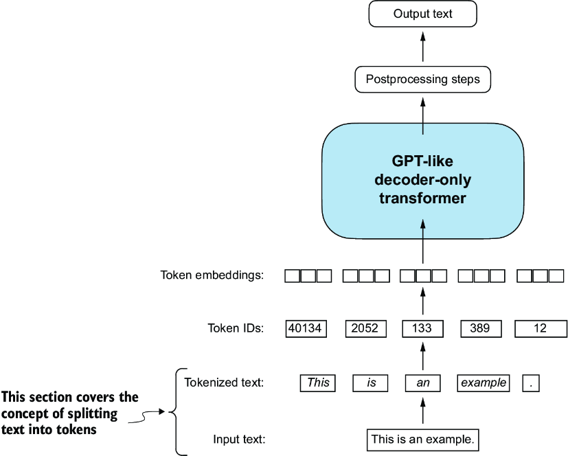
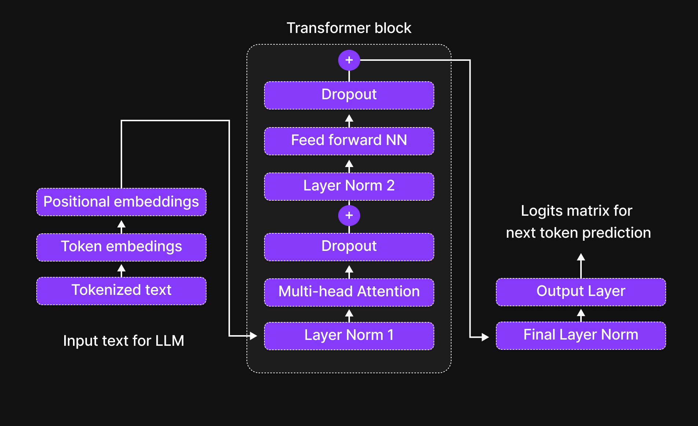
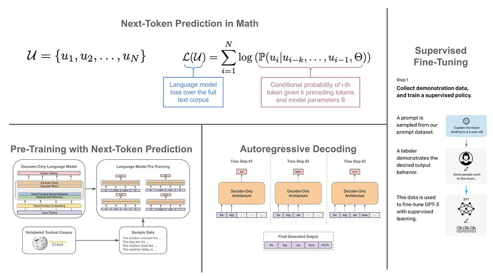
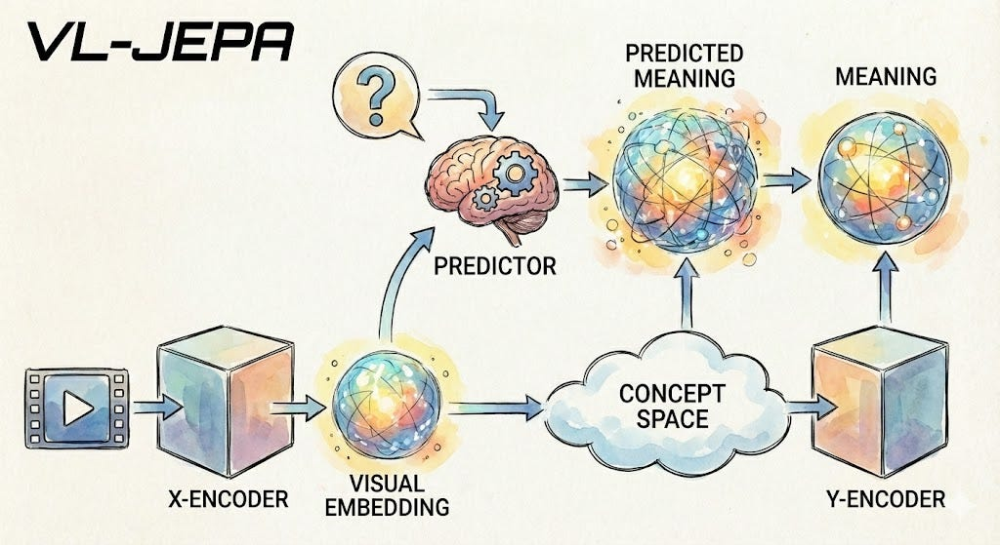
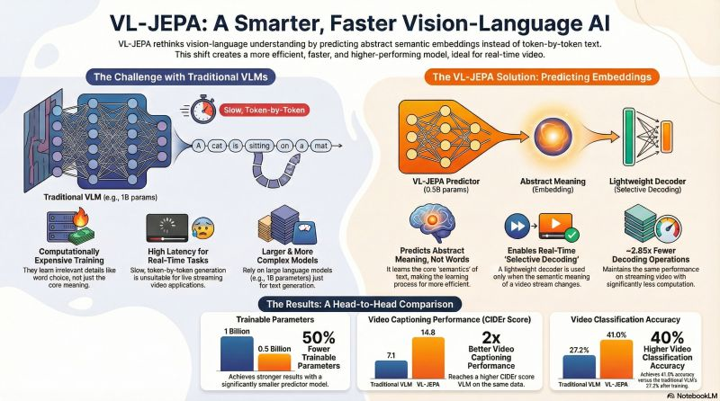
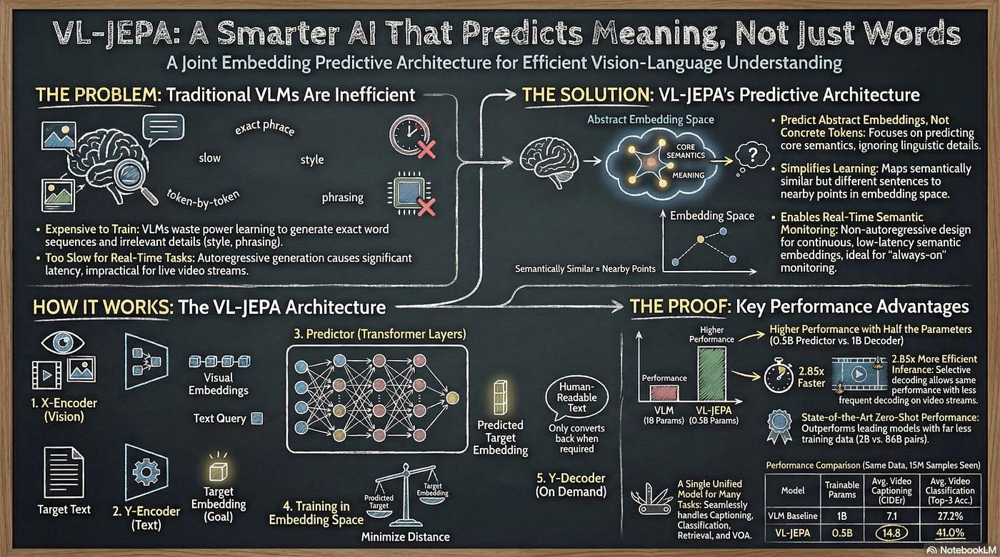
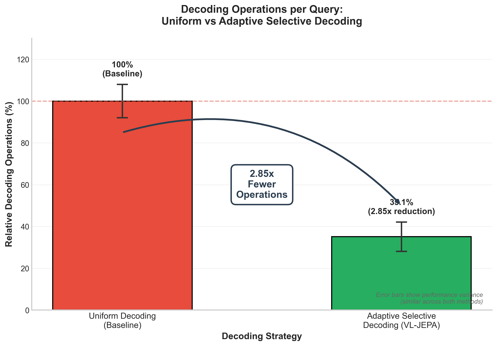
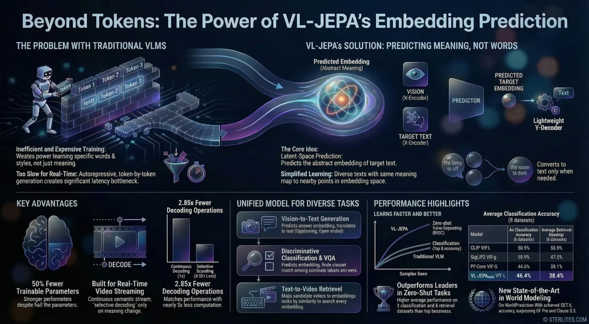

### 1. The Basics: What Are Tokens in LLMs?

Large Language Models (LLMs) like GPT, Llama, or Grok don't "read" text the way humans do. They work with **tokens**  small pieces of text (words, sub-words, punctuation, or even parts of words).

**Example**:  
"The cat sat on the mat."  
→ Tokenized as something like: ["The", " cat", " sat", " on", " the", " mat", "."]

Each token is converted into a numerical **embedding** (a high-dimensional vector that captures meaning). The model then learns patterns from millions of these tokens.

This is why LLMs feel "smart"  but they're really just very good at guessing the next token in a sequence.

### 2. How Traditional LLMs (and VLMs) Work

Traditional LLMs are **autoregressive**: they predict one token at a time, left to right.

- Input tokens + previous predictions → Transformer layers → Probability distribution over next token  
- Pick the most likely token → Add it to the sequence → Repeat  

Vision-Language Models (VLMs) like LLaVA, Qwen-VL, or InstructBLIP do the same thing but add a vision encoder (e.g., ViT or CLIP) that turns images/videos into tokens or embeddings. The model still generates text **token-by-token**.

This works amazingly well for chatbots… but it has hidden costs.

### 3. The Problems with the Traditional Approach

- **Wasteful training**: The model has to learn both meaning *and* every possible phrasing/style. It wastes compute on surface details.  
- **Slow for real-time video**: Every frame needs full token-by-token generation  even if nothing changed.  
- **Hallucinations**: If unsure, it still has to output *some* tokens, often inventing confident nonsense.  
- **High latency & parameters**: Bigger models = more expensive inference.

This is exactly what Yann LeCun has criticized for years: next-token prediction is not how human intelligence works.

### 4. Enter VL-JEPA: Predicting Meaning, Not Words

VL-JEPA (Vision-Language Joint Embedding Predictive Architecture) from Meta FAIR (Dec 2025 paper) flips the script.

**Core idea**: Instead of generating tokens in data space, the model predicts **continuous embeddings** (abstract "thought vectors") of the *meaning* of the answer.

It learns in a semantic latent space where similar meanings (e.g., “the lamp is off” and “room goes dark”) collapse to nearby points  ignoring exact wording.

### 5. How VL-JEPA Actually Works (Architecture)

Here’s the flow:

1. **X-Encoder** (Vision): Frozen V-JEPA 2 ViT-L  turns images/videos into rich spatio-temporal embeddings (S_V). Handles 8–32 frames natively.  
2. **Y-Encoder** (Target Text): Takes the ground-truth answer/caption and turns it into a semantic embedding (S_Y).  
3. **Predictor** (The “Brain”): 8 layers from Llama-3.2-1B. Takes visual input + optional query, predicts the target embedding Ŝ_Y in **one single forward pass** (non-autoregressive!).  
4. **Y-Decoder** (Only when needed): A tiny autoregressive decoder turns the predicted embedding into actual text  and only when the meaning actually changes (selective decoding).

Loss = simple InfoNCE (pull predicted embedding close to real one, push unrelated ones apart). Two-stage training: massive pretraining on captions → supervised fine-tuning on VQA/captioning.

### 6. Advantages of VL-JEPA

- **50% fewer trainable parameters**  yet matches or beats much larger token-based VLMs on video tasks.  
- **~2.85× fewer decoding steps** thanks to selective decoding  perfect for live video streaming.  
- **Native multi-task support**: One model does classification, retrieval, discriminative VQA, and captioning without changes.  
- **Less hallucination-prone** and more robust to phrasing variations (focuses on semantics).  
- **SOTA on video benchmarks**  outperforms CLIP, SigLIP2, and Perception Encoder on 8 classification + 8 retrieval datasets while staying competitive on VQA.  
- **Real-time ready**: Ideal for streaming, robotics, live action recognition.

### 7. Disadvantages & Honest Limitations

No model is perfect. Real-world feedback and reviews highlight:

- **Generation quality depends on the lightweight decoder**: Open-ended creative writing or long fluent paragraphs can feel less natural than pure autoregressive giants.  
- **Early-stage skepticism**: Some researchers argue it’s still “sophisticated pattern matching” in latent space rather than true world understanding or physics simulation. It might overfit visual biases in training data.  
- **Local semantics weakness**: Masked embedding prediction can sometimes lose fine-grained local details (a known issue in related JEPA-style models).  
- **Broader generalization questions**: Strongest on video understanding; performance on purely text-heavy or extremely open-ended tasks needs more exploration.  
- **Not fully open yet**: As of March 2026, no official weights or code from Meta (unlike V-JEPA 2), so community experimentation is limited.

In short: VL-JEPA is revolutionary for **understanding** and efficiency, but it’s not (yet) a complete replacement for token-based generation in every scenario.

### Conclusion: The Future Shift

VL-JEPA is Yann LeCun’s vision in action: intelligence is about predicting meaning and building world models  not just auto-completing words.

It proves you can have stronger, faster, more efficient multimodal AI by separating “thinking” (embedding prediction) from “talking” (decoding).  

This is likely the direction of next-gen AI  especially for real-time video, robotics, and agents.

### Disclimer

Most of the contents are AI generated, can make mistakes. Check important info.

### Ref 
- [https://arxiv.org/pdf/2512.10942](https://arxiv.org/pdf/2512.10942)